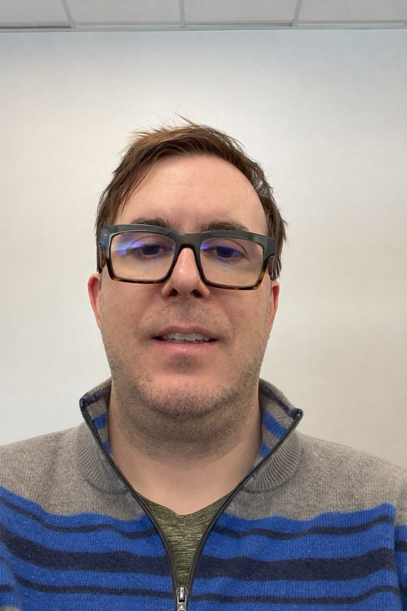

# Jacob Nollette

Minneapolis, MN • jacob@jacobnollette.com • 952‑428‑9199

I work at the intersection of DevOps, Site Reliability, Platform Engineering, and Linux administration, with a focus on CI/CD pipelines, Kubernetes, Terraform, and developer tooling. I administer and automate mixed Unix-like environments including Ubuntu, Debian, Darwin/macOS, and BSD systems, alongside virtualization and network platforms such as Proxmox, UniFi OS, pfSense, and TrueNAS. At TSI, my mission is to turn complex infrastructure into reliable, scalable systems that make software delivery faster, safer, and more predictable. I’m a strong believer in supported golden paths, shared ownership, and collaboration as the foundation for sustainable engineering and real innovation.

## CORE COMPETENCIES

CI/CD & Automation: Jenkins \- automated modular pipelines and shared Groovy libs, lots of experience with GitLab Runners, significant experience with GitHub Actions. Built and maintained Kubernetes projects with Terraform and Docker. Created virtual machines with Packer. Deployed to GCP with Terraform; Deployed to AWS with Terraform and CloudFormation. Docker, Bash, PowerShell.

Cloud & Virtualization: GCP, AWS, Azure, Kubernetes, Hyper‑V, Proxmox, DigitalOcean, Hetzner

Networking & Security: Supply‑chain scanning (Artifactory/X‑Ray), Sonarqube build blocking, UniFi networking, pfSense, Tailscale, HAProxy, NGINX, IAM/SSO/MFA (Duo/TOTP), OWASP hardening.

AI & Agents: Github Copilot, ChatGPT (RAG), Claude, Gemini, Ollama (Open WebUI), high‑performance n8n hosting, Go‑based agent/webhook load testing, API scripting (curl \+ jq), structured agent inputs (JavaScript), compounded RAG inputs in n8n

Storage & Data: Ceph (CRUSH rules), ZFS (ARC/log/meta tuning), MinIO (S3/IAM), MySQL/Postgres/MSSQL orchestration & backups, DR automation, retention policies, tiered storage, P2P/real‑time sync

Programming & Scripting: Bash, Groovy, Powershell, PHP, Javascript, Go

Tooling & Platforms: Docker, Jira, Bitbucket, Confluence, GitLab, GitHub, Retool, WordPress, FFmpeg, Rclone, Nextcloud, Notion, VS Code, Vim, TMUX, Ubuntu/Debian, Scratch containers

## PROFESSIONAL EXPERIENCE

### DevOps Engineer — TSI Inc.

Shoreview, MN • 2022 (Feb) – Present

At TSI Incorporated, I design and maintain CI/CD pipelines using Jenkins and Git, and provision Kubernetes platforms with Terraform. I build and operate a range of custom environments, including no-code/low-code appliances, QA infrastructure, mobile device emulation systems, and secure code-signing services. I deploy Kubernetes applications declaratively with Terraform and orchestrate their build and release workflows using Docker and Jenkins.

CI/CD & Release Engineering

* Rebuilt CI/CD for 15+ microservices (Kubernetes & cloud‑native) using Jenkins \+ Docker \+ Bash, converging 15 discrete pipelines into a single trunk‑based deployment pipeline spanning four GCP projects.

  * *How:* Jenkins MPL Shared Library (Groovy) for DRY stages (build → test → scan → artifact → deploy). Containerized build agents; parameterized pipelines for env‑specific deploys.

  * *Security/Quality gates:* JFrog X‑Ray supply‑chain scanning and SonarQube; build‑blocking on critical findings.

  * *Impact:* Cut deployment time from half/full days → 13 minutes for the entire service set.

* Built a Go‑based CLI to spin up a standardized Docker development shell with baked‑in env/creds, enabling reproducible local deploys that mirror CI environments.

Kubernetes, Cloud Infra & VM Appliances

* Provisioned microservices & CronJobs via Terraform and OCI images; standardized image baselines and deployment variables to reduce drift between environments.

* Delivered Retool as a version‑controlled VM appliance: read‑only configuration sync from Git, CI/CD to bake and ship images, and runbooks to automate tenant‑specific deployment tasks.

* Managed Windows dev/QA fleets: patch management, always‑on stability for developers, and coordinated deprecations across rolling software cycles.

* Hyper‑V/VMware/Proxmox packaging for internal appliances; build once, publish to multiple hypervisor targets.

Security, SSO/MFA & SRE

* Launched MFA across cloud vendors and enforced SSO via domain controller, shrinking access‑review/termination effort and tightening IAM posture.

* Hunted and reduced supply‑chain vulnerabilities with Artifactory/X‑Ray; formalized recurring maintenance jobs to prevent drift.

* Disaster‑recovery automation and platform ownership for Jira/Confluence/Bitbucket: scheduled exports, tested restores, and infra runbooks.

Industrial/IoT & Data Segmentation (selected)

* Enabled Retool to safely interface with an air‑gapped IoT monitoring network (Linux/Postgres): parallel subnet design, egress via VPN, and strict ACLs, preserving isolation while allowing controlled read operations.

### Systems Engineer — LuminFire

Minneapolis, MN • 2018 (Jan) – 2022 (Feb)

At LuminFire, I introduced and operationalized modern Agile and CI practices, including migrating teams to GitLab and maintaining the platform for over half of my tenure. I served as the primary maintainer for the company’s WordPress portfolio, architecting and hardening the hosting stack while implementing customizations to improve performance, reliability, and security. Over time, I introduced tooling and best practices that reduced friction in the monthly maintenance cycle and improved operational consistency. I also developed infrastructure-as-code solutions on AWS using Systems Manager and CloudFormation to standardize environments and automate deployments.

* Automated migration from Bitbucket Cloud → self‑hosted GitLab (bash), including object storage and OpenSearch/Elastic for deep code search.

* Scaled GitLab by moving assets to object storage, and instance sizing / IOPS tuning..

* Authored AWS CloudFormation templates to assemble “build boxes” from native services (CodeCommit, Secrets Manager, Session Manager, EC2, RDS, S3) and a standardized Ubuntu/PHP/Bash stack.

* Implemented TrueNAS (ZFS) with automated DR snapshots/scrubs to protect creative assets from bit‑rot.

* Rolled out Duo MFA, Jamf MDM, and VPN to enable zero‑trust remote work (2020).

* Built custom WordPress/front‑end components (CSS/JS) with an emphasis on performance and pixel accuracy.

### Principal — [jacobnollette.com](http://jacobnollette.com) LLC / Self Hosting Lab

Minneapolis, MN • 2005 (Jan) – Present

I run jacobnollette.com LLC and the Self Hosting Lab as one continuous practice. From 2011–2018, this was primarily full-time client consulting focused on WordPress development, front-end engineering, and CMS/platform delivery. Since 2018, it has continued as a professional side practice and R&D platform for production-grade DevOps, infrastructure, and reliability engineering patterns that I apply in enterprise environments.

* Delivered SEO- and metadata-driven WordPress marketing sites; built custom themes/modules and performant CSS/JavaScript implementations in close collaboration with design teams.

* Introduced Docker- and NGINX-based deployment patterns into client projects, helping shift delivery from traditional web development toward DevOps/platform engineering practices.

* Designed and operated a private-cloud homelab spanning Proxmox virtualization, Kubernetes (KubeSpray/Ansible), and Ceph-backed storage (CephFS/RBD) with custom CRUSH rules.

* Improved Ceph reliability via BlueStore/OSD recovery and reconfiguration; restored quorum and healthy PG balance after storage topology issues.

* Built secure data/storage services with MinIO on CephFS, scoped S3 IAM policies, lifecycle/retention automation, and real-time sync pipelines (Syncthing/Resilio/RClone CronJobs).

* Implemented zero-exposure networking patterns using Cloudflare Tunnels, Tailscale mesh access, and HAProxy L4/L7 load balancing.

* Operated Proxmox Backup Server with deduplicated backups, scheduled verify/scrub, and cost-optimized off-site retention (S3 to Hetzner migration).

* Ran GPU-accelerated workloads for AI/agent experimentation (n8n, Ollama), plus multi-node media ingest/transcoding with NVENC and Tdarr.

### Webmaster & Tech Consultant to the Board of Directors — Little Sand Lake Area Association

### (Limited hours / Side projects)

Dorset, MN • 2018 (April) – Present

For the Little Sand Lake Area Association, I modernized and expanded the organization’s web and technical infrastructure to significantly reduce the manual effort required to operate the nonprofit. I designed and built a member portal that supports recurring subscriptions, eliminating the need for annual manual dues collection. I onboarded approximately 150 properties using county records and created a searchable, map-based GIS directory to support membership management and lake stewardship.

I led a full redesign of the website using open-source themes to reduce ongoing costs while improving usability and maintainability. I secured nonprofit hosting and productivity grants, including Azure credits for web hosting and Google Workspace for collaboration, archiving, and object storage of official board materials. Since 2019, I have attended, recorded, transcribed, and summarized quarterly board and annual meetings, applying AI tooling to document and archive the organization’s technical and operational history.

* Membership ops \+ directory in WordPress using Gravity Forms/GravityKit with Stripe subscriptions; freed volunteers from manual dues processing.

* Secured hyperscale grant credits, driving hosting costs near zero; implemented multi‑cloud DR for critical assets and real‑time canary/availability monitoring.

### Webmaster — Steiger Heritage Club

### (Limited hours / Side projects)

Minnesota • 2021 (August) – Present

For the Steiger Heritage Club, I provided end-to-end technical administration across Azure Nonprofit Cloud Hosting, Google Workspace, Mailchimp, and a WordPress VPS environment. I was responsible for hosting, monitoring, security, and ongoing maintenance of the website. I established the organization’s initial online presence by designing the “coming soon” launch pages and defining a foundational brand identity that largely remains in use today. I continue to manage the site under nonprofit cloud grants, ensuring reliable, cost-effective hosting and long-term sustainability.

* Stood up WordPress hosting stack; designed identity design (visual) system and launched assets; configured mailing list automations.

* Remediated DDoS and tuned WAF to stabilize public‑facing endpoints.

### Creative Developer — Clear Software for Good

Minnesota • 2010 (April) \- 2012 (May)

At Clear Software for Good, I worked as a WordPress developer delivering front-end implementations and graphics-heavy interfaces in collaboration with Ruby on Rails teams. This role introduced me to Git-based workflows and automated deployments, including operating Capistrano-driven deployment pipelines. I customized the WordPress CMS, built interactive front-end components, and supported Rails applications with CSS and shared UI patterns. I also designed visual interface assets using Adobe Creative Cloud to ensure consistency between design and implementation.

## SELECTED DEEP‑DIVE HIGHLIGHTS

* Trunk‑based multi‑project deploys (GCP): single Jenkins pipeline orchestrated builds for 15+ services across 4 projects; Groovy DRY code → staged Docker build → unit test → X‑Ray/SonarQube → artifact publish → Terraform apply; per‑env promotion with guarded approvals; 13‑minute full rollout.

* Air‑gapped data access with Retool: designed for bastion host access; gated VPN‑gated egress; enforced principle‑of‑least‑privilege with role‑scoped queries.

* Ceph reliability engineering: corrected an OSD identity/FSID collision; re‑laid BlueStore with a 250 GB block.db on NVMe to move RocksDB off HDDs; updated CRUSH to respect host/device‑class failure domains; restored healthy PG states and improved tail latency.

## EDUCATION

B.F.A., Web & Screen Environments — Minneapolis College of Art and Design (Fall 2020\)

Blended design, typography, and interactive media with full‑stack development; produced new media installations, motion graphics, film/video, photography, and sound design materials; hands‑on fabrication (laminated plywood, machined metals).

Activities and societies: Summer Expressions Session TA and Instructor, produced and engineered student activities events for Radio MCAD, The Audio Lounge, and Schoolgirls & Mobilesuits (national academic anime conference).
